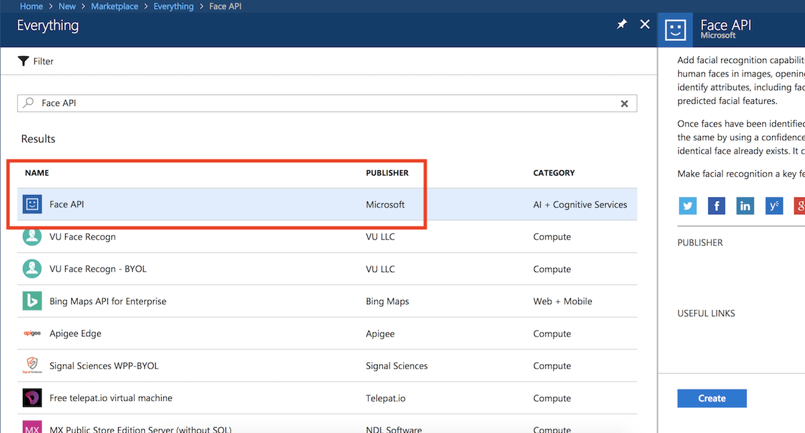
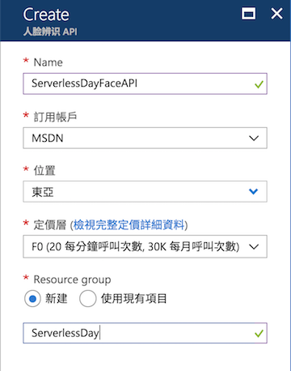
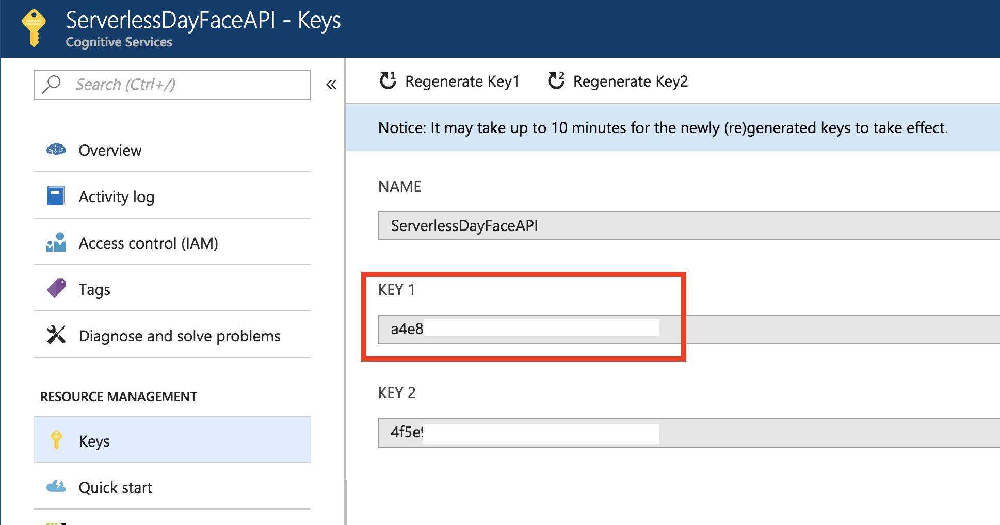
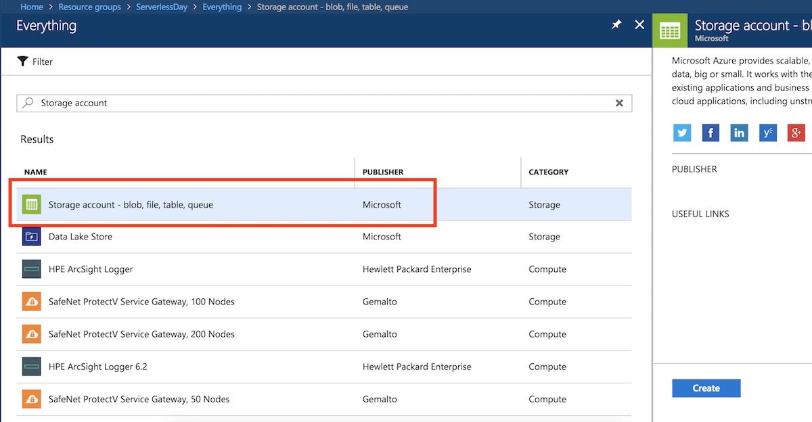
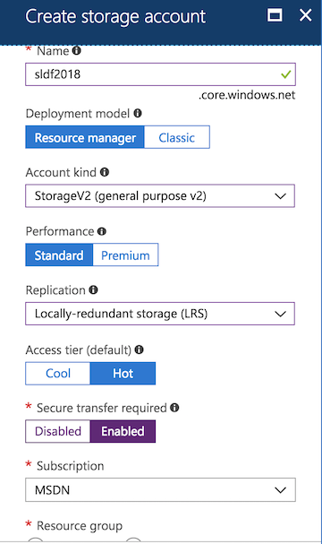
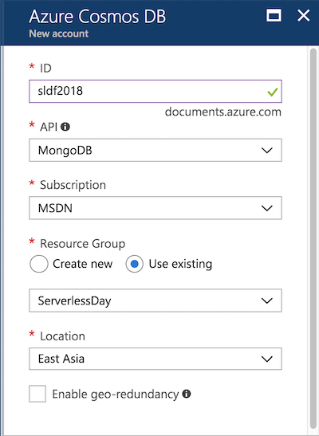
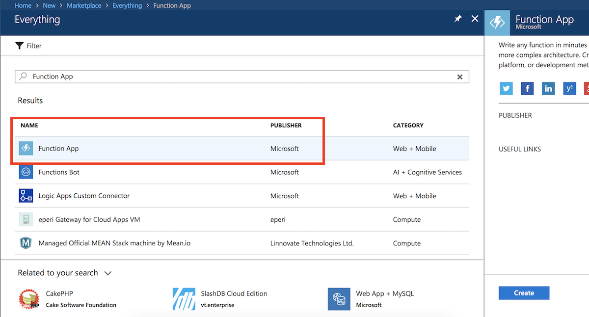
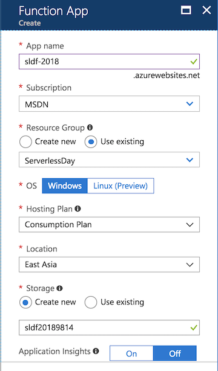

# Face Identification Service

In this lab, we would use [Azure Congnitive Services: Face APIs](https://azure.microsoft.com/zh-tw/services/cognitive-services/face/) to handle the faces and identification processes. The [Azure Functions](https://azure.microsoft.com/zh-tw/services/functions/), a serverless application platform on Azure, would orchestrate the whole process.

## Goal

- Create an online custom face identification services from scratch.
- Be familiar with Azure Functions.
- Be familiar with Azure Congnitive Services.

## Prerequisites

- A Microsoft Azure subscription. (Trial account is also fine) [Sign up for free](https://azure.microsoft.com/zh-tw/free/).
- [Azure Storage Explorer](http://storageexplorer.com/) for manipulating Cosmos DB and Storage account.
- Prepare some photos for training and verifications.
- (optional) Node.js for Azure Function local runtime.

## Steps

### Claim a Face API Access Key

1. Login [Azure portal](https://portal.azure.com/), and click **+ Create a resource (+ 建立資源)**  at the top-left corner. Search for **Face API** and select the item which is _published by Microsoft_.

   

2. On the creation blade:

    a. You can use the name you want or type _ServerlessDayFaceAPI_ in the **Name** field.
    
    b. **Location** could be _East Asia_.
    
    c. Select _F0_ in the **Pricing tier** for leveraging the free quota.
    
    d. Finally, type _ServerlessDay_ in the **Resource group** field.
    
    e. Click the **Create** button on the bottom.

   

3. After successfully created, navigate to the Face API resource you've just created. Go to the **Keys** section to retrieve your access keys.

   > If the keys are accidentally leaked to public or hacked by others. You can also **regenerate** the keys in this section.

    

### Create Services with Azure Functions

#### Set Up the Fundamental Resources

1. Login [Azure portal](https://portal.azure.com/), and create a **Azure Storage account** for storing the photo of faces. Select the _Storage account_ published by _Microsoft_.

   

2. For creating the storage account:

    a. Type a unique name in **Name** field
    
    b. Set **Deployment model** to _Resource manager_
    
    c. Use _Storage V2_ as the **Account kind**.
    
    d. Set **Performance** to _Standard_
    
    e. Use _LRS_ in the **Replication** field
    
    f. Use _Hot_ in **Access tier**
    
    g. _Enable_ the **Secure transfer required**.
    
    h. Use the same **Resource group** and **Location** with Face API.

    i. Click **Create** button to start creation.

   

3. Now, let's create a **Cosmos DB** instance for storing the meta data of the faces. Click the **+ Create a resource** and search for the _Cosmos DB_.

   

4. For creating the Cosmos DB:

    a. Type a unique name in the **ID** field. It determines the URL of the Cosmos DB instance.
    
    b. Select _MongoDB_ in **API** field (_SQL_ is recommended if you use C#/.NET as programming language).
    
    c. Use the same **Resource group** and **Location** as previous resources.

    d. Click **Create** button to start creation.

   

5. Now we start to create the Azure Function app. Click **+ Create a resource (+ 建立資源)**  at the top-left corner. Search for **Function App** and select the item which is _published by Microsoft_.

   

6. For creating the Function app:

    a. Set a unique name in **Name** field.
    
    b. Select the same **Resource group** with the Face API, too.
    
    c. Use _Consumption Plan_ in the **Hosting plan**.
    
    d. **Location** is set to the same region of the Face API, could be _East asia_.
    
    e. The others are left default values.

    f. Click **Create** button to start creation.

   

